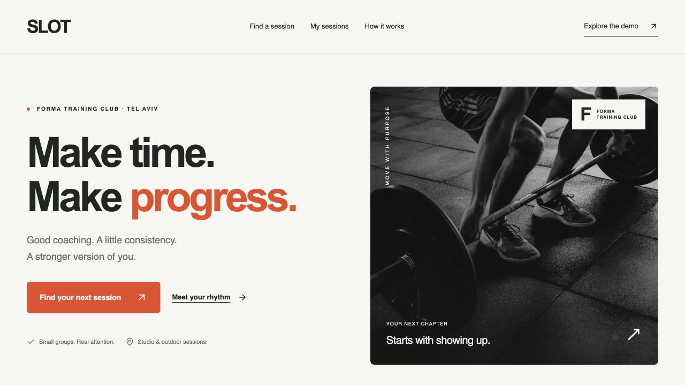
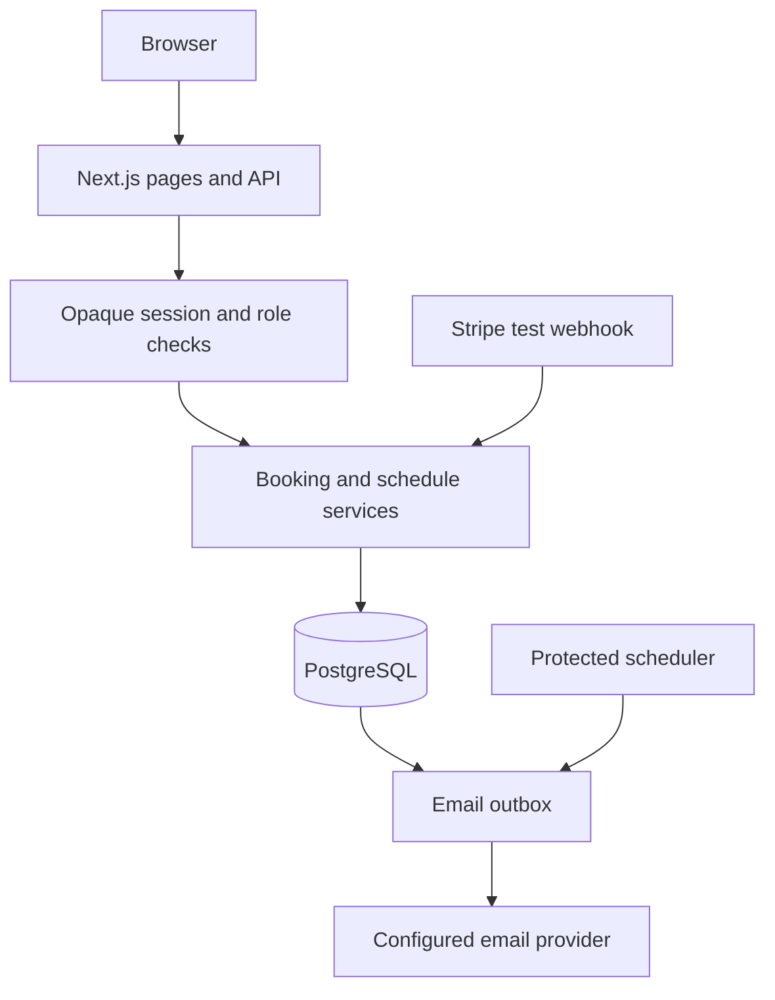

# SLOT

**Make time. Make progress.**

  



## Overview

A booking product for an independent sports coach. A fictional studio makes the experience easy to explore; reservations, capacity protection and server authorization use real application logic.

## Try it

A public deployment is not claimed until its URL is recorded here and verified. Run locally at `http://localhost:3050` using the instructions below. The in-app **How it works** page explains the implementation and its limits.

**Two-minute walkthrough:** Open /demo → Explore as a client → select a session → reserve → confirm demo payment → My sessions → reschedule or cancel → switch to coach → run the concurrency demo.

## Features

- A mobile booking calendar with individual and group sessions, expiring holds, confirmation, rescheduling and cancellation.
- A coach workspace for services, working windows, breaks, absences, attendance and an audit trail.
- Private demo workspaces with server-side role checks and a two-client, last-place reservation exercise.
- Optional Stripe **test** checkout with signed webhooks, event idempotency, amount checks, late-payment handling and coach refunds.
- An optional email outbox for non-demo studios; confirmations and reminders require a configured provider and scheduler.

## Architecture



See [Architecture](docs/ARCHITECTURE.md), [Deployment](docs/DEPLOYMENT.md) and [Verification](docs/VERIFICATION.md).

## Stack

Next.js App Router, React, strict TypeScript, Zod, Lucide, hand-written responsive CSS, Vitest and Playwright. Public pages use Server Components; interactive controls stay in small client components. GitHub Actions checks source quality, tests and builds.

SLOT uses parameterized SQL through `pg`, versioned migrations, and PostgreSQL transaction guards. Direct SQL makes the locking and constraints reviewable. PGlite is used only for the local single-process demo.

## Getting started

Node.js 24 LTS is recommended. Keep the checkout outside cloud-synced folders that may evict local files.

```bash
npm ci
npm run demo
```

The demo command creates a local configuration, applies migrations and starts the production build. It never resets existing databases. Stop the running app before operating on the same PGlite directory from a second process.

## Tests

```bash
npm run check
npm run build
npx playwright install chromium
npm run test:e2e
```

For database integration tests, stop the local application first, run `npm run db:migrate`, then `npm run test:integration`. Use a disposable database. The CI service uses native PostgreSQL, not PGlite.

The browser suite includes desktop and mobile-sized Chromium projects. Some restricted macOS agent environments cannot launch Chromium; this is an environment failure, not a passing test. See the verification record for what was actually executed.

## Environment and Docker

Copy `.env.example`; never commit `.env`. Optional providers are disabled without configuration. See [Deployment](docs/DEPLOYMENT.md) for required variables and limitations.

```bash
docker compose up --build
```

Docker configuration is supplied. A Docker build is not claimed as tested unless noted in the verification record.

## Project structure

```text
src/app/          Pages and route handlers
src/components/   Focused interactive UI
src/lib/          Types, validation and pure domain helpers
src/server/       Server-only integrations where needed
tests/            Domain tests and browser journeys
docs/             Architecture, evidence and learning guides
.github/          CI configuration
```

## Current limits and next steps

- The public coach and studio are fictional. The default payment is simulated; no money moves. Live Stripe keys are deliberately rejected.
- PGlite is a single-process local convenience. It is not a distributed PostgreSQL deployment or a contention benchmark. Use native PostgreSQL for hosting and concurrency validation.
- A coach is provisioned through a script. Self-service signup, password reset, multi-coach permissions, calendar sync and real payments are future work.
- Stripe, Resend, scheduled delivery and refunds have not been exercised against live external services without credentials. Provider behavior is separately gated from domain tests.

## Presentation and learning

- [One-minute captioned video](public/demo/walkthrough-en.mp4) · [Text version](public/demo/walkthrough-en.txt). Real screenshots, edited, no audio.
- [Reproducible demo](docs/DEMO.md).
- [French interview and learning guide](docs/INTERVIEW.fr.md).
- [Credits and rights](docs/CREDITS.md).
- [Contributing](CONTRIBUTING.md).

Built with AI assistance, with explicit tests and limitations. Understanding and explaining the implementation is part of the learning process. No invented users, usage metrics or performance claims are presented as real.

## License

Original application code: MIT. Third-party packages and media keep their own licences; see the credits file.
