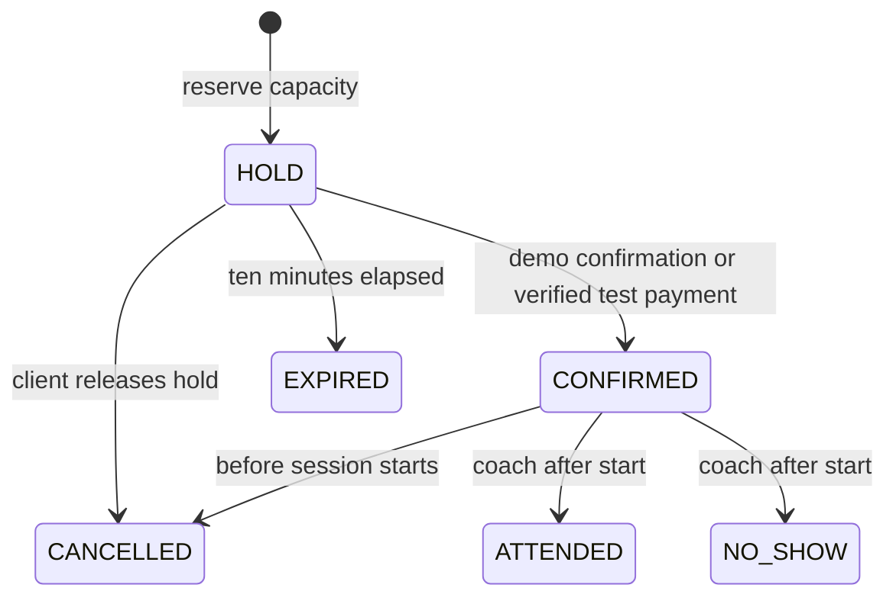

# Architecture

## Boundaries and data

One Next.js application serves the public coach page, authenticated pages and API routes. UI components never open a database connection. Route handlers validate inputs with Zod, check the request origin, obtain an opaque session, and call domain services. Database access is parameterized SQL through a small adapter. A separate backend would add deployment and session complexity without a clear benefit for this scope.

A workspace owns people, services, working windows, absences, slots, reservations and audit records. Composite foreign keys prevent cross-workspace references. Sessions contain random tokens; the database stores only their SHA-256 digests and expiry. Non-demo passwords use Argon2. Authorization loads current roles server-side; a button being hidden is not a security boundary.

## Reservation state machine

Payment has an independent state: PENDING, DEMO_PAID, STRIPE_PAID, REFUND_REQUIRED, REFUNDED or NOT_REQUIRED. Cancellation does not imply a completed refund. An expired hold receiving payment never becomes a confirmed reservation automatically.

## Concurrency

Domain mutations lock the owning workspace row before reading capacity or changing schedule. This serializes mutations within the small studio and avoids a read-then-write race. Database triggers additionally reject capacity overflow, duplicate active bookings, overlapping coach slots, out-of-hours slots and conflicting absences. The workspace-wide lock is deliberately coarse and easy to explain; separate studios remain independent.

The booking and availability operations keep validation and writes inside the transaction. Rescheduling either succeeds completely or preserves the original booking. Price, duration, capacity and recovery buffer are copied onto a slot so editing a service does not silently change existing terms.

PGlite provides a convenient local PostgreSQL-derived engine in a single process. It serializes transactions itself. The two-request demo tests the real domain path, but does not prove multi-process contention. CI uses native PostgreSQL connections. Do not run two local processes against one PGlite directory.

## Time

The studio uses an IANA timezone. Civil times are converted using Temporal with ambiguous and nonexistent local times rejected. Instants are stored as timestamptz; display always includes the studio timezone. Duration and buffer use elapsed minutes. Tests cover daylight-saving gaps and folds. The current public demo is Asia/Jerusalem.

## Integrations

A Stripe Checkout URL does not prove payment. The signed webhook checks test mode, event ID, session reference, amount and currency. Duplicate events are stored once. Late payments are marked for refund. Refund requests use a booking-specific idempotency key.

An outbox separates booking changes from email delivery. Demo studios never enqueue recipient email. A protected scheduler queues near-term reminders, sends at most five messages per invocation, retries within a bounded window, and removes expired demo data. Provider acceptance is not proof of inbox delivery. Configure and test the external services before advertising delivery as active.

## Tradeoffs and growth

The app polls its own studio state every 15 seconds; it does not claim a realtime socket. Add an outbox-backed event channel only when necessary. Future growth would require connection-pool budgeting, a shared request limiter, more granular locks and explicit retry policy, studio-level membership, self-service recovery and integration monitoring. Audit entries contain action names and IDs, not raw credentials or provider payloads.

Refer to migrations and the integration tests for the executable source of database rules. The test-only studio is not a production payments or medical coaching service.
